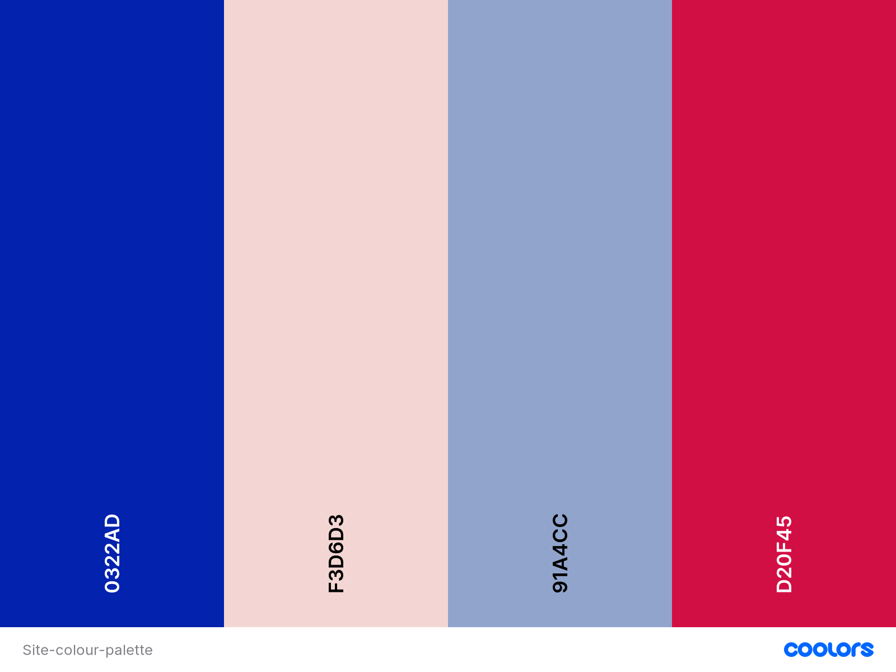

# Serii Skincare 
Serii Skincare is an indie skincare brand that allows users to purchase products for the face and body.

Visit the live site [here](https://serii-skincare.herokuapp.com/)


---
---
# Contents
+ [User Experience](#user-experience)
  + [User Stories](#user-stories)
  + [Design](#design)
+ [Features](#features)
+ [Database](#database)
+ [Technologies Used](#technologies-used)
+ [Testing](#testing)
+ [Deployment](#deployment)
+ [Credits](#credits)
  + [Content](#content)
  + [Media](#media)
  + [Acknowledgements](#acknowledgements)
---
---


# User Experience
## User Stories
---

### As an unregistered, I want to :

+ Browse all available products
+ Browse each product category 
+ View each product individually 
+ View my bag and and unpurchased products in it 
+ Add, edit quantity and remove items from my bag
+ Purchase a product without registering for an account
+ Be able to register for an account if I don't have one

### As a registered user, I want to:

+ Log into the site with own account
+ See a record of past purchases
+ Be able to navigate to each past purchase product page
+ Be able to save my delivery information
+ Be able to change/update my delivery information
+ Have the access and functionality as unregistered users

### As the site administrator, I want to:

+ Be able to log into the admin panel
+ Be able to add, edit or remove products, without vistiting the admin panel.
+ Be able to view all orders and site info via the admin panel


## Design

For this site, I wanted something soft and a bit playful but not too busy so it feels like a place for quality products. 


### Colour Scheme
The colour scheme is made up of soft pinks, pale blue and a deep ultramarine 



The colours, while not the most neutral, are still soft enought not to overwhelm the user.
I used the ultramarine for text and buttons to make them stand out. It's a better alternative to black or dark grey as it has high contrast, but still fits the brand image. 
The gold adds a touch of decadance.


### Typography
For the general font throught the site I chose [Mukta Malar](https://fonts.google.com/specimen/Mukta+Malar?query=mal)as it is clean, easy to read and contrast well with the brand name font

The brand font I chose is [STIX Two Text](https://fonts.google.com/specimen/STIX+Two+Text?query=stix)as it felt grounded but not too serious and would be good for drawing attention to various area of the site against the other simpler Mukta Malar font. 


# Features
## Current Features
### **Navigation menu displayed on pages**

The navigation menu on all pages hepls users move easily through the site.

The navigation buttons update depending on whether a user is logged in, logged out or logged in as Admin:

| Nav Link              |Not logged in  |Logged in as user|Logged in as admin
|:-------------         |:------------- |:----------------|:------------- |
|Logo(back to home)     |yes            |yes              |yes
|Product Management     |no             |no               |yes
|My Profile             |no             |yes              |yes
|Sign Out               |no             |yes              |yes
|Register               |yes            |no               |no
|Sign In                |yes            |no               |no
|All Nav Products       |yes            |yes              |yes


### **Registration not required to browse**

Perhaps the most importaqnt feature as most users will simply want to browse the site out of curiosity. 


### **Registration not required to purchase**

This was the second important feature as the majourity of users will want to buy quickly so being required to have an account to buy would be time consuming and off putting to users.  

### **User profile creation**

If a user wants to create a profile, they can. The features of registations are:

+ Username
   + A user can choose a unique username thats not taken but any other user
   + A notification will tell user if their undername is avaialble

+ Email address
   + A user needs to create a profile using an email address
   + The email is required twice to decrease chance of user error
   + An automatic email is sent to the user to confirm it is their the email address and set up their account 

+ Password
   + The password must be entered twice to decrease chance of user error 

A user with a profile can:
+ Access order history displayed in their profile.
+ Save default delivery information to their profile from the checkout page
+ Update default delivery information to their profile from their profile page


---

### **Products Page**

Both authorised and unorthorised users can browse the products.
They browse the following product options
Products can be sorted by:

+ Shop All:
   + All products
   + By Price
   + By Rating
   + By Category


+ Skincare:
   + Face wash
   + Moisturisers
   + Toners
   + Serums
   + All skincare


+ Bodycare:
   + Body wash
   + Body lotion
   + Body scrub
   + All Bodycare
+ Fragrance:
   + Perfumes


+ Special offers:
   + New arrivals
   + Sale
   + All special offers

All product options can be sorted by:

   + Price (low to high)
   + Price (high to low)
   + Rating (low to high)
   + Rating (high to low)
   + Name (A-Z)
   + Name (Z-A)
   + Catergory (A to Z)
   + Catergory (Z to A)


---


### **Product Details Page**

From the product detail page, the user can:
+ View Product name
+ View Product description
+ Select a quantity 
+ Add product to bag 
+ Go back to all products page 


### **Admin CRUD functionality**

Admin users have all the features of non admin users with the addition of CRUD functionality. From the site admin can add, edit and delete products, without the admin panel
+ Add Product: 
Located in the 'My Account' dropdown, in 'Product Management'.


+ Edit Product: 
Located in the 'My Account' dropdown, in 'Product Management'. Or from the products catergory pages or the individual product detail page will naviagate to the edit product form in 'Product Management'. 

+ Delete Product:
From the products catergory pages or the individual product detail page. 


### **Bag page**

A user can navigate to the bag page to see what items they placed in it.  

From the bag a user can:  
+ Increase or decreae the quantity of a product
+ Remove a product
+ Naviagate to the checout page

---

### **Checkout page**

In the checkout page a user can:
+ Input new delivery information if needed or are checking out as a guest
+ Use their saved default delivery address if they are a registered user logged in
+ Pay via Stripe for secure payments
+ update their profile with the inputted edlivery information(if they have an account and are logged in)
+ A loading screen will appear when a payment is being processed to encourage the user to wait
+ Stripe will still create the order if the payment form doesn't submit properly or the user closes the browser prematurely 
+ An order confirmation email wil be sent to the user containing order details 

---

### **Emails**

The site will send real emails for:

+ New customer registration email validation
+ Order confirmation
+ A user needs to update their password
---

### **Toasts**

Toasts notify users of whats happening or actions being taken, such as, but not limited to:

+ When a user sucessfuly signs in/signs out
+ When a user adds a product to a bag
+ When an admin adds/edits items
+ When an admin's CRUD action fails
+ When a user is viewing previous order details
+ Stripe key not found 
+ When a user is trying to access an unautorized page

---

## Future Features
+ A rating system where users can rate or comment previously purchased prodcuts 
+ Ability to 'save' products to a users own account to refer back to.
+ Allow users to delete their account


## Defensive Design

Defensive design features are as follows:

+ Form validation:
   + Form will show warning and not submit of data is incorrect
   + Image files are vefified by Django's ImageField

+ Adding products to the bag:
   + A user cannot add more that 99 of a product to the bag at one time
   + A user cannot add 0 quantity of a product to the bag
   + If an item is in a bag an the user changes the quantity to 0, the item will be removed from the bag

+ Default images:
   + The images if an image is not present, a default image will take its place

+ Authenticated vs unauthenticated user pages:
   + The @login_required decorator has been used to ensure unauthenticated users don't access unauthorised pages
   + If a user with no bag items tries to access the checkout page via URL, they will be redirected to the products page and receive a notification
   + If an unauthenticted user tries to access a restricted page they will be redirected

---

# Database

Relational databases SQLite and Postgres were used. SQLite for development and Postgres for the deployed Heroku project.


### Categories

+ Stores the product category details
+ Sends information to the products model to catagorize the type of product being sold


### Products

+ Stores the details of products the user can purchase
+ Pulls information from the categories model to catagorise the type of product being sold
+ Sends information to the OrderLineItem model to create the purchase


### OrderLineItem

+ Stores a product that has been added to the users bag
+ Pulls information from the products model to add to the users order
+ Sends information to the Order model to update the order information


### Order

+ Stores the users order information
+ Pulls information from the OrderLineItem model to add products to the order
+ Pulls information from the UserProfile model to attach the order to their profile

### UserProfile

+ Stores the users delivery and order purchased order information
+ Pulls information from the User model to create the user profile
+ Sends information to the Order model to attach the order to their profile


# Deployment

## Heroku Deployment
This project was deployed to Heroku from Gitpod by doing the following:

### Requirements.txt and Procfile
For Heroku to know which packages and technologies are being used in a project we need to save them all to a requirements.txt file. Before creating the Heroku app, create these files by doing this: 
+ In the GitPod terminal, type ```pip3 freeze --local > requirements.txt``` to create your requirements file.
+ Create your Procfile and input the following: ```web: gunicorn ARTstop.wsgi:application``` Do not put a blank line beneath
+ Push these files to your repository.

### Creating Heroku App
+ Log into Heroku your heroku account (create on if you don't have one)
+ In your dashboard select 'Create New App'
+ Choose an app name, preferably similar to your project (Ensure you have no apps with the same name. You can only use an app name once)
+ Select the appropriate region closest your location
+ Click 'Create App'

### Connecting Heroku to GitHub
+ From the dashboard, click the 'Deploy' tab near the top of the screen
+ From here, locate 'Deployment Method' and choose 'GitHub'
+ A search bar will appear, find your repository by name
+ When you have found the correct repository, click 'Connect'
+ DO NOT CLICK 'ENABLE AUTOMATIC DEPLOYMENT' YET. This can cause unexpected errors before configuration.

### Environment Variables
+ Still in Heroku, click the 'Settings' tab near the top of the page
+ Scroll down to 'Config Vars' and click 'Reveal Config Vars'
+ The following variables all need to be added:

|Variable name         |Value/where to find value                                |
| ---------------------|---------------------------------------------------------|
|AWS_ACCESS_KEY_ID     |AWS CSV file(instuctions below)                          |
|AWS_SECRET_ACCESS_KEY |AWS CSV file(instuctions below)                          |
|DATABASE_URL          |Postgres generated (instructions below)                  |
|EMAIL_HOST_PASS       |Password from email client                               |
|EMAIL_HOST_USER       |Site's email address                                     |
|SECRET_KEY            |Random key generated online                              |
|STRIPE_PUBLIC_KEY     |Stripe Dashboard > Developers tab > API Keys > Publishable key |
|STRIPE_SECRET_KEY     |Stripe Dashboard > Developers tab > API Keys > Secret key |
|STRIPE_WH_SECRET      |Stripe Dashboard > Developers tab > Webhooks > site endpoint > Signing secret |
|USE_AWS               |True (when AWS set up - instructions below)              |


### Heroku Postgres Database
+ Go to the resources tab in Heroku.
+ In the Add-ons search bar look for Heroku Postgres & select it.
+ Select the Hobby Dev-Free option in plans.
+ Click submit order form.
+ Go back to the build environment and install 2 more requirements:
  + ```pip3 install dj_databse_url```
  + ```pip3 install psycopg2-binary```
  don't forget to add these to the requirements file using ```pip3 freeze > requirements.txt``` 


## Setting up AWS

### AWS S3 Bucket
+ From the 'Services' tab on the AWS Management Console, search 'S3' and click it.
+ Select 'Create a new bucket', give it a name(associated with the Heroku app name), and choose the closest region to your location.
+ Ensure 'Block all public access' is **unchecked**(you may need to confirm that public access will be granted).
+ Ignore any other settings that you are asked to change and click 'Create bucket'.
+ Open the created bucket, go to the 'Properties' tab and turn on static website hosting(fill in index.html and error.html as defaults) and click save.
+ Open the 'Permissions' tab, locate the CORS configuration section and add the following code:

```
[
  {
      "AllowedHeaders": [
          "Authorization"
      ],
      "AllowedMethods": [
          "GET"
      ],
      "AllowedOrigins": [
          "*"
      ],
      "ExposeHeaders": []
  }
]
```
+ In the 'Bucket Policy' section click 'Edit' > 'Policy Generator'.
+ Choose 'S3 Bucket Policy' from the 'Select Type of Policy' dropdown.
+ In 'Step 2: Add Statements', add the following settings:
  + Effect: **Allow**
  + Principal: **" * "** (no quotation marks)
  + Actions: **GetObject**
  + ARN: **Bucket ARN** (get from S3 Bucket page)
+ Click 'Add Statement'.
+ Click 'Generate Policy'.
+ Copy the policy from the popup that appears
+ Paste the generated policy into the Permissions > Bucket Policy area.
+ Add '/*' at the end of the 'Resource' key, and save.
+ Go to the 'Access Control List' section, and select 'List' next to 'Everyone'.

### AWS IAM (Identity and Access Management)
+ From the 'Services' tab on the AWS Management Console, search IAM and select it.
+ Go to 'User Groups' > 'Create New Group' > choose a name(associated with the S3 Bucket name) and click 'Create'.
+ Go to 'Policies' > 'Create New Policy' > 'JSON' > 'Import Managed Policy' > search 'S3' > select 'AmazonS3FullAccess' > Click 'Import'.
+ Get the bucket ARN from 'S3 Permissions'
+ Delete the '*' from the 'Resource' key and add the following code into the area:
```
"Resource": [
    "{PASTED ARN}",
    "{PASTED ARN}/*"
]
```
+ Click 'Next' > 'Review' > provide a name and description(associated with the S3 Bucket name), and click 'Create Policy'.
+ Go to 'User Groups'> Open the created group > 'Permissions' > 'Add Permissions' > 'Attach Policies' > search for the policy you created and click 'Add Permissions'.
+ Go to 'Users' > 'Add Users' > create a name and select 'Programmatic access' for the 'Access Type' option.
+ Click 'Next' and select the group you created.
+ Keep clicking 'Next' until you reach the 'Create user' button and click that. 
+ Download the CSV file which contains the AWS_SECRET_ACCESS_KEY and your AWS_ACCESS_KEY_ID needed in the Heroku variables.
+ **IF YOU DO NOT DOWNLOAD THIS NOW YOU WILL NOT GET ANOTHER OPPORTUNITY**

## Set up Emails

**For the email, I used GMail. Other email providers can be used but the process may differ**

+ Go to settings.py and change the DEFAULT_FROM_EMAIL to your chosen email address.
+ If you want to set up a new Gmail account for the site, this is the time to do so.
+ Go to the Gmail account and open the 'Settings' tab.
+ Go to 'Accounts and Imports' > 'Other Google Account Settings'.
+ Go to the 'Security' tab and open 'Signing in to Google'.

+ Click on '2-step Verification', click 'Get Started' and turn on 2-step verification following their instructions.
+ Go to 'Security' > 'Signing in to Google' > 'App Passwords'.
+ (You may have to input your account password again) Set 'App' to 'Mail', 'Device' to Other, and name it 'Django'.
+ The passcode that appears will be used in your Heroku variables.

## Deploy
+ In Heroku, once all the variables are in place, locate 'Manual Deploy' > choose the master branch and click 'Deploy Branch'.
+ Once the app is built (it might take a bit of time), click 'Open App' from the top of the page.
+ Go back to the 'Deploy' tab and you can now click 'Enable Automatic Deployment'. Changes automatically deploy when you make do git push

## Forking the Repository
+ Log in to GitHub and locate the GitHub Repository.
+ At the top of the Repository above the "Settings" Button on the menu, locate the "Fork" Button.
+ You will have a copy of the original repository in your GitHub account.
+ You will now be able to make changes to the new version and keep the original safe. 

## Making a Local Clone
+ Log into GitHub.
+ Locate the repository.
+ Click the 'Code' dropdown above the file list.
+ Copy the URL for the repository.
+ Open Git Bash on your device.
+ Change the current working directory to the location where you want the cloned directory.
+ Type ```git clone``` in the CLI and then paste the URL you copied earlier. This is what it should look like:
  + ```$ git clone https://github.com/Darlyn-Lurikah/serii_skincare```
+ Press Enter to create your local clone.

To install all packages, in the terminal type ```pip install -r requirements.txt``` which will do it for you, so you don't have to do it one by one and risk an error. 


# Testing
As the testing section would have made this document too long, you can find it [here](https://github.com/Darlyn-Lurikah/serii_skincare/blob/main/TESTING.md).


# Technologies Used
## Languages
+ [HTML5](https://en.wikipedia.org/wiki/HTML5)
+ [CSS3](https://en.wikipedia.org/wiki/CSS)
+ [JavaScript](https://en.wikipedia.org/wiki/JavaScript)
+ [Python3](https://www.python.org/)

## Frameworks and Libraries
+ [Django](https://www.djangoproject.com/)
+ [Pip3](https://pip.pypa.io/en/stable/)
+ [jQuery](https://jquery.com/)
+ [FontAwesome](https://fontawesome.com/)
+ [Google Fonts](https://fonts.google.com/)
+ [Bootstrap](https://getbootstrap.com/)

## All Others
+ [Heroku](https://www.heroku.com/): To deploy live site
+ [GitPod](https://www.gitpod.io/): To develop project and organise version control
+ [GitHub](https://github.com/): Used to host repository
+ [Stripe](https://stripe.com/en-ie): For the payments system
+ [AWS](https://aws.amazon.com/): Used for file storage
+ [Figman](https://www.figma.com/): To create wireframes
+ [RandomKeygen](https://randomkeygen.com/): To create a strong password for required  `<SECRET_KEY>`.
+ [Lighthouse](https://developers.google.com/web/tools/lighthouse): For performance review
+ [Am I Responsive](http://ami.responsivedesign.is/): To README intro image
+ [Adobe Illustrator](https://www.clipconverter.cc/2/): To edit product photo size
+ [Adobe Photoshop](https://autoprefixer.github.io/): To design products


# Credits
## Code


+ This site was built on the base of the [Boutique Ado](https://github.com/ckz8780/boutique_ado_v1) walkthrough by [Chris Zielinski](https://github.com/ckz8780) via Code Institute.

+ The [Django Docs](https://docs.djangoproject.com/en/3.2/) were very helpful throughout this project


## Media
 


## Acknowledgements

+ Tutor support, for their consistent help and patience
+ My mentor Antonio Rodriguez for all his help and guideance
+ My sister because she keeps me sane even if she doesn't mean to 

